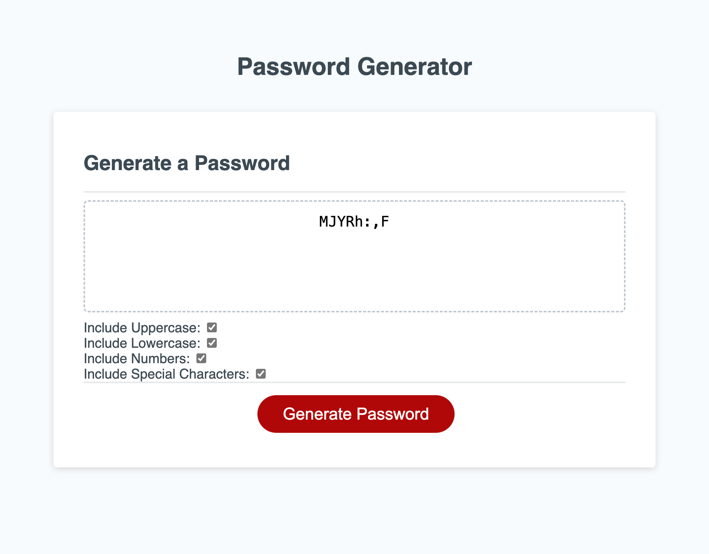
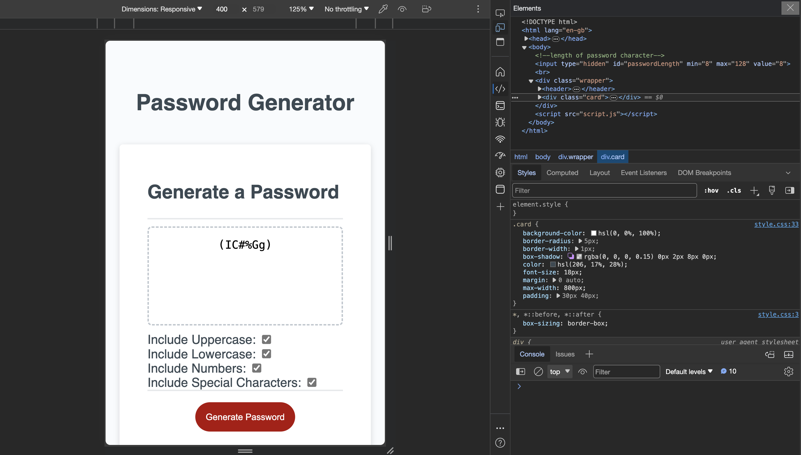

# Password-Generator..-
Table of Contents
Intro on Challenge
Link to repo
Link to URL
Screenshot of my password genereator

This week's challenge was to demonstrate how to generate passwords generator. We were provided with html and css and Javascript. However i had to show how create password generator using different functionalities such as uppercased, lowercased, numeric numbers and special character passwords. This was achieved and has been showed on my screenshot. 

[link to deployed account](https://graceemah17.github.io/Password-Generator..-/)

[link to github Password Generator](https://github.com/GraceEmah17/Password-Generator..-.git)

